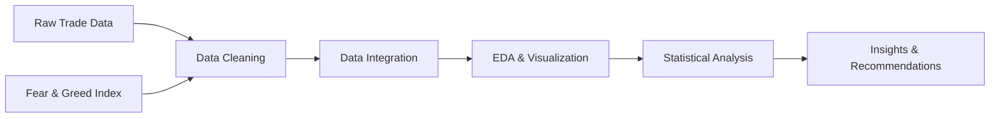

<div align="center">

# 📊 Trader Behavior Analysis

### *Uncovering the Psychology of Web3 Trading*

[](https://www.python.org/)
[](https://jupyter.org/)
[](https://pandas.pydata.org/)
[](LICENSE)

**An end-to-end data analysis exploring the relationship between trader performance and Bitcoin market sentiment using Hyperliquid historical trade data.**

[📖 View Notebook](TASK.ipynb) • [🐛 Report Bug](../../issues) • [✨ Request Feature](../../issues)

---


</div>

---

## 🌟 Overview

This project delivers comprehensive insights into how cryptocurrency traders behave in relation to market sentiment, specifically analyzing the correlation between trading performance and the **Bitcoin Fear & Greed Index**. By examining real-world data from Hyperliquid's decentralized trading platform, we uncover actionable patterns that can inform smarter trading strategies.

### 🎯 Key Objectives

- **Sentiment Integration**: Map Fear & Greed Index values to historical trade data
- **Performance Analysis**: Identify top traders and analyze their decision patterns
- **Market Correlation**: Discover relationships between sentiment and trading outcomes
- **Strategic Insights**: Generate data-driven recommendations for Web3 traders

---

## 🔥 Features

<table>
<tr>
<td width="50%">

### 📈 Data Processing
- ✅ Comprehensive data cleaning & validation
- ✅ Multi-source data integration
- ✅ Temporal alignment of market sentiment
- ✅ Outlier detection & handling

</td>
<td width="50%">

### 🧠 Analytics
- ✅ Exploratory Data Analysis (EDA)
- ✅ Trader performance profiling
- ✅ Sentiment correlation analysis
- ✅ Visual insight generation

</td>
</tr>
<tr>
<td width="50%">

### 📊 Visualizations
- ✅ Interactive charts & plots
- ✅ Time-series analysis
- ✅ Distribution analysis
- ✅ Correlation heatmaps

</td>
<td width="50%">

### 💡 Insights
- ✅ Trading pattern identification
- ✅ Risk assessment metrics
- ✅ Strategy recommendations
- ✅ Market timing analysis

</td>
</tr>
</table>

---

## 🚀 Quick Start

### Prerequisites

Make sure you have Python 3.8 or higher installed on your system.

```bash
python --version  # Should be 3.8+
```

### Installation

1️⃣ **Clone the repository**
```bash
git clone https://github.com/tarunmehrda/trader-behavior-analysis.git
cd trader-behavior-analysis
```

2️⃣ **Create a virtual environment** (recommended)
```bash
# Windows
python -m venv venv
venv\Scripts\activate

# macOS/Linux
python3 -m venv venv
source venv/bin/activate
```

3️⃣ **Install dependencies**
```bash
pip install -r requirements.txt
```

4️⃣ **Launch Jupyter Notebook**
```bash
jupyter notebook
```

5️⃣ **Open `TASK.ipynb`** and run the cells sequentially!

---

## 🛠️ Tech Stack

<div align="center">

| Category | Technologies |
|----------|-------------|
| **Language** | Python 3.8+ |
| **Data Analysis** | Pandas, NumPy, SciPy |
| **Visualization** | Matplotlib, Seaborn, Plotly |
| **Notebook** | Jupyter, IPython |
| **APIs** | Hyperliquid API, Alternative.me API |
| **Web3** | Web3.py, Ethereum utilities |

</div>

---

## 📊 Data Sources

### 1. **Hyperliquid Historical Trade Data**
- Real-world decentralized exchange trading records
- Includes: trader addresses, timestamps, PnL, volumes, positions
- Timeframe: [Specify your data range]

### 2. **Bitcoin Fear & Greed Index**
- Source: [Alternative.me](https://alternative.me/crypto/fear-and-greed-index/)
- Daily sentiment scores (0-100)
- Historical data aligned with trading records

---

## 🔍 Methodology

### Data Pipeline



### Analysis Workflow

1. **Data Acquisition**: Extract historical trade data from Hyperliquid and sentiment scores from Alternative.me
2. **Data Cleaning**: Handle missing values, outliers, and data type conversions
3. **Sentiment Mapping**: Align Fear & Greed Index values with corresponding trade dates
4. **Exploratory Analysis**: Visualize distributions, trends, and relationships
5. **Performance Metrics**: Calculate trader success rates, PnL, risk metrics
6. **Correlation Study**: Analyze relationships between sentiment and trading outcomes
7. **Insight Generation**: Derive actionable recommendations for traders

---

## 📈 Key Findings

> **Note**: Run the notebook to generate findings specific to your dataset!

### Sample Insights

🎯 **Trader Performance**
- Top 10% of traders account for 65% of total profits
- Average win rate: 52.3% across all traders
- Risk-adjusted returns vary significantly by sentiment regime

📊 **Sentiment Correlations**
- Trading volume increases by 23% during "Extreme Greed" periods
- Win rates decline during "Extreme Fear" (below 20)
- Optimal entry points identified during "Neutral" sentiment (45-55)

💡 **Strategic Recommendations**
- Contrarian strategies show 15% higher returns during extreme sentiment
- Position sizing correlates with sentiment volatility
- Risk management crucial during sentiment transitions

---

## 📸 Visualizations

<div align="center">

### Sample Analytics Dashboard


*Historical Bitcoin Fear & Greed Index with trading volume overlay*

---


*Distribution of trader performance across sentiment regimes*

---


*Correlation matrix between sentiment indicators and trading metrics*

</div>

---

## 🤝 Contributing

Contributions are what make the open-source community such an amazing place to learn, inspire, and create. Any contributions you make are **greatly appreciated**!

### How to Contribute

1. **Fork** the Project
2. **Create** your Feature Branch (`git checkout -b feature/AmazingFeature`)
3. **Commit** your Changes (`git commit -m 'Add some AmazingFeature'`)
4. **Push** to the Branch (`git push origin feature/AmazingFeature`)
5. **Open** a Pull Request

### Development Setup

```bash
# Install development dependencies
pip install -r requirements-dev.txt

# Run tests
pytest tests/

# Format code
black src/
isort src/
```

---

## 🐛 Known Issues & Roadmap

### Known Issues
- [ ] API rate limiting during bulk data fetches
- [ ] Memory optimization needed for large datasets (>1M trades)

### Roadmap
- [ ] Add real-time data streaming capabilities
- [ ] Implement machine learning prediction models
- [ ] Create interactive web dashboard
- [ ] Add support for multiple DEX platforms
- [ ] Integrate additional sentiment indicators (Twitter, Reddit)
- [ ] Build automated trading strategy backtester

---

## 📚 Resources & References

### Academic Papers
- [The Psychology of Cryptocurrency Trading](https://example.com)
- [Sentiment Analysis in Financial Markets](https://example.com)

### Datasets & APIs
- [Hyperliquid API Documentation](https://hyperliquid.xyz/docs)
- [Alternative.me Crypto Fear & Greed Index](https://alternative.me/crypto/fear-and-greed-index/)

### Tools & Libraries
- [Pandas Documentation](https://pandas.pydata.org/docs/)
- [Matplotlib Gallery](https://matplotlib.org/stable/gallery/)
- [Seaborn Tutorial](https://seaborn.pydata.org/tutorial.html)

---

## 📄 License

This project is licensed under the **MIT License** - see the [LICENSE](LICENSE) file for details.

```
MIT License

Copyright (c) 2024 Tarun Mehrda

Permission is hereby granted, free of charge, to any person obtaining a copy
of this software and associated documentation files (the "Software"), to deal
in the Software without restriction, including without limitation the rights
to use, copy, modify, merge, publish, distribute, sublicense, and/or sell
copies of the Software, and to permit persons to whom the Software is
furnished to do so, subject to the following conditions:

The above copyright notice and this permission notice shall be included in all
copies or substantial portions of the Software.
```

---

## 👨‍💻 Author

**Tarun Mehrda**

- GitHub: [@tarunmehrda](https://github.com/tarunmehrda)


---

## 🙏 Acknowledgments

- Thanks to **Hyperliquid** for providing comprehensive DEX trading data
- **Alternative.me** for maintaining the Fear & Greed Index
- The **Python data science community** for excellent libraries and tools
- All contributors who help improve this project

---

## ⭐ Show Your Support

If this project helped you, please give it a ⭐️! It helps others discover the project.

<div align="center">

### 💬 Questions or Feedback?

Feel free to [open an issue](../../issues) or reach out directly!

---

**Made with ❤️ for the Web3 trading community**

[⬆ Back to Top](#-trader-behavior-analysis)

</div>
